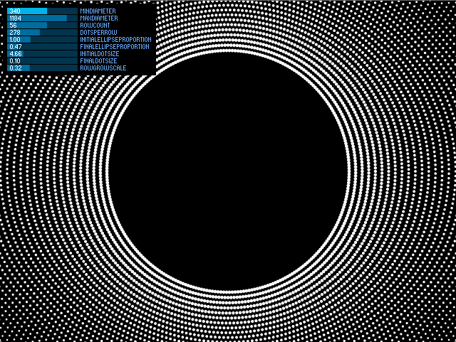

#Processing Dot Gradient Generator

Originally created for **100 Noites com Poemas** poster/bookmark project.

The following work is © 2014 by Alexandre Castro ([www.fimdomeio.com](http://www.fimdomeio.com)) and Marta Casaca and is Open Source Software under a [Creative Commons Attribution 4.0 International License](http://creativecommons.org/licenses/by/4.0/)

made with [Processing](http://processing.org/)